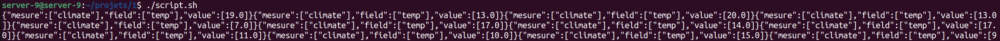
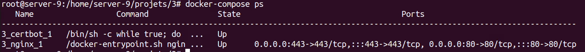
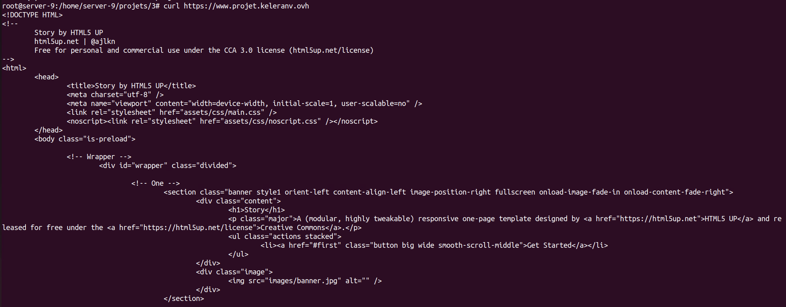

# 8INF911: Mini-Projets-Docker

Ce dépot contient les ressources des quatres mini-projets réalisés par Léo VANSIMAY et Gaël LECONTE dans le cadre du cours **Architecture Cloud et Méthodes DevOps, outils pour le Cloud-Gaming** pour le trimestre d'été 2022 à l'UQAC.


## TODO List

- [x] Sujet 1
- [x] Sujet 2
- [x] Sujet 3
- [ ] Sujet 4

### Ressources Md

- [Cheatsheet](https://www.markdownguide.org/cheat-sheet/)
- [Style en plus (icones réseaux et tout)](https://yushi95.medium.com/how-to-create-a-beautiful-readme-for-your-github-profile-36957caa711c)

## Table des matières

1. [VISUALISATION DE DONNEES IOT – FASTAPI / INFLUXDB](#1-visualisation-de-donnees-iot-–-fastapi--influxdb)
2. [DISPONIBILITE DE SERVICE](#2-disponibilite-de-service)
3. [HEBERGEMENT WEB (VERSION NGINX)](#3-hebergement-web-version-nginx)
4. [HEBERGEMENT WEB (VERSION TRAEFIK)](#4-hebergement-web-version-traefik)

## 1. VISUALISATION DE DONNEES IOT – FASTAPI / INFLUXDB

Notre idée initiale était de créer deux images, une pour utiliser l'API *pyflux*, et l'autre pour lancer *InfluxDB* et le configurer automatiquement. Mais nous avons remarqué qu'une image *InfluxDB* était disponible sur [DockerHub](https://hub.docker.com/), et que si certaines variables d'environements sont configurées, alors le service pourra se configurer tout seul. On fixe ainsi la variable `DOCKER_INFLUXDB_INIT_MODE` sur `setup` dans le fichier `docker-compose.yml`.

Pour des raisons de sécurité, aucune information confidentielle n'est renseignée dans ce fichier, nous utilisons à la place le fichier `.env` qui est par défaut chargé par docker-compose pour fixer les variables d'environnement.

**N-B:** Dans le contexte pédagogique, le `.env` est présent sur le dépôt git, mais dans une situation de production, ce fichier ne doit pas être communiqué, étant donné qu'il sert à configurer un produit pour un client.

### Fonctionnement du projet

Une fois la commande `docker-compose up` lancée, le port 3000 du conteneur *pyflux* est exposé et mappé sur le port 3000 de la machine hôte, on peut donc joindre l'API en envoyant des requêtes à l'adresse <http://localhost:3000>. Pour populer la base de données, on se sert du script `script.sh`:

```bash
#!/bin/bash
while true
do
   v=$(shuf -i 5-20 -n 1)
   curl -X POST http://localhost:3000/climate/temp/$v
   sleep 1
done
```



## 2. DISPONIBILITE DE SERVICE

Ici l'idée est de mettre en évidence la disponibilité applicative en utilisant le reverse-proxy de Nginx. L’objectif est de créer un conteneur qui sera utilisé en frontal d’un ensemble de conteneurs, situé sur leur réseau propre, qui pourront être mis à l'échelle par Docker.
On utilise Nginx (documentation: [Nginx](https://hub.docker.com/_/nginx)) pour gérer l’équilibrage de charge sur les conteneurs whoami (documentation: [Whoami](https://hub.docker.com/r/containous/whoami)).
Pour la configuration du reverse proxy, le fichier de configuration de base de nginx situé dans /etc/nginx/conf.d à été écrasé par `nginx.conf`:

```bash
event{}
http{server {
   listen 80;
   location / {
      proxy_pass http://whoami;
      proxy_set_header   Host             $host;
      proxy_set_header   X-Real-IP        $remote_addr;
      proxy_set_header   X-Forwarded-For  $proxy_add_x_forwarded_for;
   }
}
}
```
### Fonctionnement du projet

Une fois la commande `docker-compose up` lancée, le port 80 du conteneur *nginx* est exposé et mappé sur le port 80 de la machine hôte, on peut donc joindre les conteneurs *whoami* en envoyant des requêtes à l'adresse <http://localhost>. Le fichier de configuration `nginx.conf` redirige ainsi toute requête reçu sur le port 80 aux conteneurs.


## 3. HEBERGEMENT WEB (VERSION NGINX)




## 4. HEBERGEMENT WEB (VERSION TRAEFIK)
