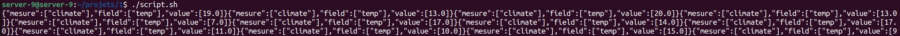
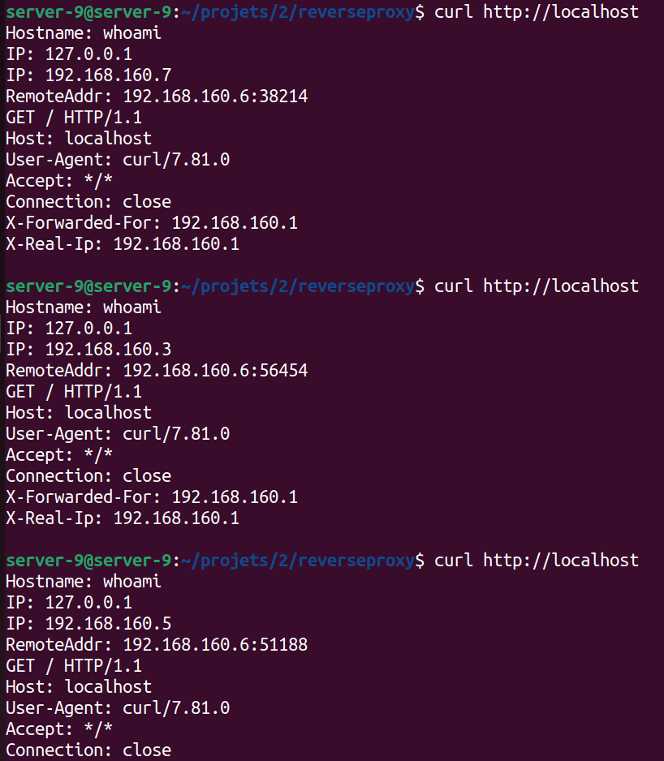
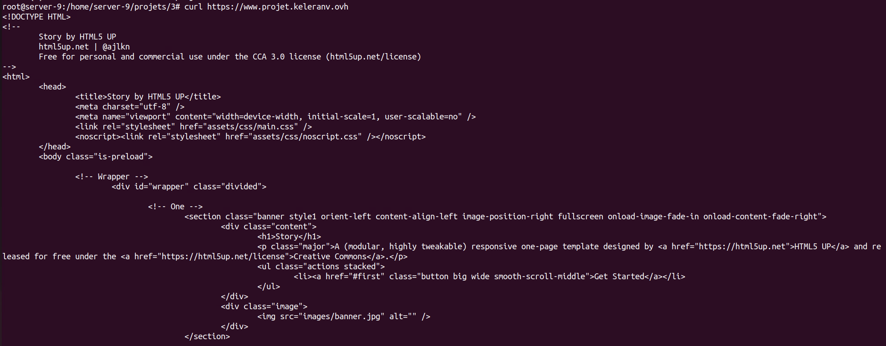

# 8INF911: Mini-Projets-Docker

Ce dépot contient les ressources des quatres mini-projets réalisés par Léo VANSIMAY et Gaël LECONTE dans le cadre du cours **Architecture Cloud et Méthodes DevOps, outils pour le Cloud-Gaming** pour le trimestre d'été 2022 à l'UQAC.

## TODO List

- [x] Sujet 1
- [x] Sujet 2
- [x] Sujet 3
- [ ] Sujet 4

### Ressources Md

- [Cheatsheet](https://www.markdownguide.org/cheat-sheet/)

## Table des matières

1. [VISUALISATION DE DONNEES IOT – FASTAPI / INFLUXDB](#1-visualisation-de-donnees-iot-–-fastapi--influxdb)
2. [DISPONIBILITE DE SERVICE](#2-disponibilite-de-service)
3. [HEBERGEMENT WEB (VERSION NGINX)](#3-hebergement-web-version-nginx)
4. [HEBERGEMENT WEB (VERSION TRAEFIK)](#4-hebergement-web-version-traefik)

## 1. VISUALISATION DE DONNEES IOT – FASTAPI / INFLUXDB

Notre idée initiale était de créer deux images, une pour utiliser l'API *pyflux*, et l'autre pour lancer *InfluxDB* et le configurer automatiquement. Mais nous avons remarqué qu'une image *InfluxDB* était disponible sur [DockerHub](https://hub.docker.com/), et que si certaines variables d'environements sont configurées, alors le service pourra se configurer tout seul. On fixe ainsi la variable `DOCKER_INFLUXDB_INIT_MODE` sur `setup` dans le fichier `docker-compose.yml`.

Pour des raisons de sécurité, aucune information confidentielle n'est renseignée dans ce fichier, nous utilisons à la place le fichier `.env` qui est par défaut chargé par docker-compose pour fixer les variables d'environnement.

```bash
DOCKER_INFLUXDB_INIT_URL="http://influxpro:8086"
DOCKER_INFLUXDB_INIT_ORG="my-org"
DOCKER_INFLUXDB_INIT_BUCKET="my-bucket"
DOCKER_INFLUXDB_INIT_ADMIN_TOKEN="my-token"
DOCKER_INFLUXDB_INIT_USERNAME="my-user"
DOCKER_INFLUXDB_INIT_PASSWORD="my-password"
```

**N-B:** Dans le contexte pédagogique, le `.env` est présent sur le dépôt git, mais dans une situation de production, ce fichier ne doit pas être communiqué, étant donné qu'il sert à configurer un produit pour un client.

### Fonctionnement du projet

Une fois la commande `docker-compose up` lancée, le port 3000 du conteneur *pyflux* est exposé et mappé sur le port 3000 de la machine hôte, on peut donc joindre l'API en envoyant des requêtes à l'adresse <http://localhost:3000>. Pour populer la base de données, on se sert du script `script.sh`:

```bash
#!/bin/bash
while true
do
   v=$(shuf -i 5-20 -n 1)
   curl -X POST http://localhost:3000/climate/temp/$v
   sleep 1
done
```



## 2. DISPONIBILITE DE SERVICE

Ici l'idée est de mettre en évidence la disponibilité applicative en utilisant le reverse-proxy de Nginx. L’objectif est de créer un conteneur qui sera utilisé en frontal d’un ensemble de conteneurs, situé sur leur réseau propre, qui pourront être mis à l'échelle par Docker.
On utilise Nginx (documentation: [Nginx](https://hub.docker.com/_/nginx)) pour gérer l’équilibrage de charge sur les conteneurs whoami (documentation: [Whoami](https://hub.docker.com/r/containous/whoami)).
Pour la configuration du reverse proxy, le fichier de configuration de base de nginx situé dans /etc/nginx/conf.d à été écrasé par `nginx.conf`:

```bash
event{}
http{server {
   listen 80;
   location / {
      proxy_pass http://whoami;
      proxy_set_header   Host             $host;
      proxy_set_header   X-Real-IP        $remote_addr;
      proxy_set_header   X-Forwarded-For  $proxy_add_x_forwarded_for;
   }
}
}
```

### Fonctionnement du projet

Une fois la commande `docker-compose up` lancée, le port 80 du conteneur *nginx* est exposé et mappé sur le port 80 de la machine hôte, on peut donc joindre les conteneurs *whoami* en envoyant des requêtes à l'adresse <http://localhost>. Le fichier de configuration `nginx.conf` redirige ainsi toute requête reçu sur le port 80 aux conteneurs.



## 3. HEBERGEMENT WEB (VERSION NGINX)

L'objectif de ce mini projet est de créer un service Docker permettant l’hébergement d’un site web avec Nginx. Le site ne sera pas présenté frontalement mais sera accessible à travers un service de proxy Nginx.
Un certificat électronique sera automatiquement généré en utilisant l’API de l’hébergeur OVH. Pour réaliser ce projet, vous devez être propriétaire d’un nom de domaine OVH.
Le certificat électronique sera généré par LetsEncrypt qui procèdera à une vérification de la possession du nom de domaine pour lequel vous demandez à créer un certificat. Nous paramètrerons l’utilitaire de génération de certificat certbot pour réaliser un challenge DNS auprès de LetsEncrypt.

### Arborescence de travail

Dans un dossier *Nginx* nous insérons un fichier de configuration du service `Dockerfile`, ainsi qu’un dossier `site`, prévu pour stocker l’arborescence du site web.
Dans le `Dockerfile` le dossier de stockage sera dans */home/site* en lecture seule.

```Dockerfile
FROM alpine:latest

RUN apk update
RUN apk add nginx
RUN apk add openrc

RUN openrc
RUN touch /run/openrc/softlevel

RUN rc-update add nginx

VOLUME /home/server-9/projets/3/nginx/site /home/site:ro

RUN service nginx start

EXPOSE 80/TCP
ENTRYPOINT /bin/sh
```

Le site web généré sera un site issu de [HTML5Up](https://html5up.net/) dont nous avons placé l'archive dans `nginx/site`

### Conteneur de service

Dans un dossier *Cert* nous insérons un fichier de configuration du service `Dockerfile` avec les caractéristiques suivantes :

```Dockerfile
FROM debian:latest

RUN apt-get update && apt-get upgrade -y
RUN apt-get install certbot python3-certbot-dns-ovh python3-certbot-nginx -y

CMD [ "/bin/sh", "-c", "while true; do sleep 1; done" ]
```

### Paramétrage de l'API OVH

Apres avoir acheté un nom de domaine, il faut créer un token. Ce token doit posséder les droits *GET PUT DELETE POST*. Le tokent est stocké dans un fichier ovh.ini situé à l'interieur du dossier *cert*.

Ensuite à l'aide de la commande suivante, on génère les certificats : `certbot certonly --dns-ovh --dns-ovh-credentials /ovh/.ovh.ini -d <fqdn>`

### Docker-compose.yml

À la racine du projet, on créer un fichier *docker-compose.yml* où l'on déclare les conteneurs *nginx* et *cerbot*.

```yml
version: "3.9"

services:
  certbot:
    build:
      context: ./cert
      dockerfile: Dockerfile
    volumes:
      - ./cert/ovh/:/ovh:ro
      - certs:/etc/letsencrypt
  nginx:
    image: nginx
    hostname: nginx
    volumes:
      - ./site.conf:/etc/nginx/conf.d/site.conf
      - ./nginx/site/html5up-story:/home/site:ro
      - certs:/etc/letsencrypt:ro
    networks:
      - front
      - back
    ports:
      - "80:80"
      - "443:443"
networks:
  front:
  back:

volumes:
  certs:
```

Les ports 80 et 443 sont mappé pour http et https.

Un volume *certs* est déclaré et est utilisé dans le conteneur *certbot* en le mappant sur l’arborescence du conteneur /etc/letsencrypt.
Ce volume sera présenté aussi dans le conteneur nginx sur le même point de montage, mais en lecture seule.

### Service HTTPS

Ce service est paramétré dans le fichier *nginx/site.conf*.

```bash
server{
 listen 80;
 listen 443 ssl http2;
 listen [::]:443 ssl http2;
 server_name www.projet.keleranv.ovh;

 # SSL
 ssl_certificate /etc/letsencrypt/live/www.projet.keleranv.ovh/fullchain.pem;
 ssl_certificate_key /etc/letsencrypt/live/www.projet.keleranv.ovh/privkey.pem;
 ssl_trusted_certificate /etc/letsencrypt/live/www.projet.keleranv.ovh/chain.pem;
 location / {
  root /home/site;
  }
}

```

### Résultat

On observe bien les ports d'écoute 80 & 443 du conteneur nginx.


Après requête à l'adresse `https://www.projet.keleranv.ovh`, le site s'affiche.



## 4. HEBERGEMENT WEB (VERSION TRAEFIK)

ENLEVER LES NETWORKS!!
SITE.CONF MAL MIS??? MODIFIER DOCKERCOMPOSE.YML???
