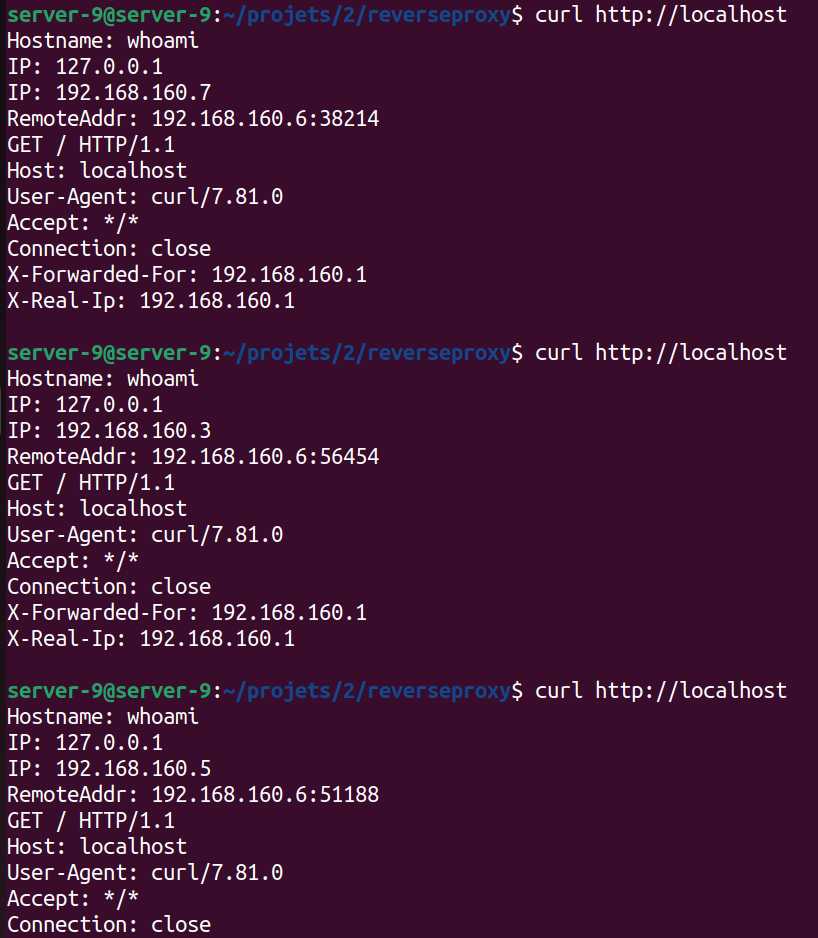

# 8INF911: Mini-Projets-Docker

Ce dépot contient les ressources des quatres mini-projets réalisés par Léo VANSIMAY[^1] et Gaël LECONTE[^2] dans le cadre du cours **Architecture Cloud et Méthodes DevOps, outils pour le Cloud-Gaming** pour le trimestre d'été 2022 à l'UQAC.

[^1]: liens vers réseaux
[^2]: liens vers réseaux

## TODO List

- [x] Sujet 1
- [x] Sujet 2
- [ ] Sujet 3
- [ ] Sujet 4

### Ressources Md
- [Cheatsheet](https://www.markdownguide.org/cheat-sheet/)
- [Style en plus (icones réseaux et tout)](https://yushi95.medium.com/how-to-create-a-beautiful-readme-for-your-github-profile-36957caa711c)

## Table des matières

1. [VISUALISATION DE DONNEES IOT – FASTAPI / INFLUXDB](#1-visualisation-de-donnees-iot-–-fastapi--influxdb)
2. [DISPONIBILITE DE SERVICE](#2-disponibilite-de-service)
3. [HEBERGEMENT WEB (VERSION NGINX)](#3-hebergement-web-version-nginx)
4. [HEBERGEMENT WEB (VERSION TRAEFIK)](#4-hebergement-web-version-traefik)

## 1. VISUALISATION DE DONNEES IOT – FASTAPI / INFLUXDB

## 2. DISPONIBILITE DE SERVICE

## 3. HEBERGEMENT WEB (VERSION NGINX)

## 4. HEBERGEMENT WEB (VERSION TRAEFIK)
